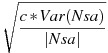
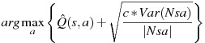

# Pessimistic Neighbourhood Aggregation for States in Reinforcement Learning

## Description
Reinforcement Learning (RL) is the task of maximising future reward by choosing the right actions in the right states. The agent typically starts out with limited knowledge about the environment, and learns from experience. When the number of states is finite and not too large, simple learning mechanisms can be devised relying on visiting the state many times. However, when the number of states is very large or infinite, no state may be visited twice. In order to learn, the agent needs to extrapolate the value of action in one state from experience from similar states. The purpose of this project will be to explore a few novel ideas for how to do this extrapolation.

## Problem Setup
The task is to learn an MDP with a finite set *A* of actions, and infinite metric space *S* of states. Sometimes we assume S has large dimensions, in which case states may be referred to as feature vectors. The value function V(s) supposed to be smooth in the state s.

## Solution Methods
### kNN-TD
**kNN-TD** combines the concept of *K-Nearest Neighbours* and *TD-Learning* to learn and evaluate Q values in both continuous and discrete state space RL problems. This method is especially useful in continuous states RL problems as the number of (state, action) pairs is very large and thus impossible to store and learn this information. By choosing a particular k-values and decided some initial points over continuous states, one can estimate Q values based on calculated the weighted average of Q values of the k-nearest neighbours for the state that the agent are currently in and use that values to decide the next move using some decision methods (i.e. UCB or epsilon-greedy). As for the learning process, one can update all of the k-nearest neighbours that contribute for the Q calculation.

**Algorithm:**
1. Cover the whole state space by some initial Q(s,a) pairs, possibly scatter it uniformly across the whole state space and give an initial value of 0/ -1
2. When an agent in a particular state, get the feature vectors representing the state and possible actions from the state
3. For each possible action from the state, calculate Q(s,a) pairs by taking the expected value from previous Q values based on k-nearest neighbours of a particular action.  
*Steps for k-nearest neighbours:*
    - Standardise every feature in the feature vectors to (-1, 1) or other ranges to make sure that one feature scale not dominate the distance calculation (i.e. if position ranges between (-50, 50) and velocity (-0.7, 0.7) position will dominate distance calculation).
    - Calculate the distance between current state and all of other points with the same action using distance formula (i.e. Euclidean distance) and store the k-nearest neighbours to knn vector, and it's distance (for weight) in weight vector
    - Determine the probability p(x) for the expected value by using weight calculation (i.e. weight = 1/distance). To calculate weight, one can use other formula as long as that formula gives more weight to closer point. To calculate p(x) just divide individual weight with sum of all weights to get probability
    - Estimate the Q(s,a) pairs using expectation formula from kNN previous Q values
4. Using epsilon greedy/ UCB/ other decision methods to choose the next move
5. Observe the reward and update the Q values for all of the neighbours on knn vector using SARSA or Q Learning. (on the code below, I use Q Learning)
6. Repeat step 2-5

### PNA (Pessimistic Neighbourhood Aggregation)
**PNA** may be viewed as a refinement for kNN, with k adapting to the situation. On the one hand, it is beneficial to use large k since that means large data can be learn from. On the other hand, it is beneficial to learn only from the most similar past experiences (small k), as the data they provide should be the most relevant.

PNA suggests that when predicting the value of an action a in a state s, k should be chosen dynamically to minimise:



where c = 1 and Var(Nsa) is the variance of observed rewards in the neighbourhood Nsa. This is a negative version of the term endorsing exploration in the UCB algorithm. Here it promotes choosing neighbourhoods that contain as much data as possible but with small variation between rewards. For example, in the ideal choice of k, all k nearest neighbours of (s, a) behave similarly, but actions farther away behave very differently.

Action are chosen optimistically according to the UCB:

  

with c > 0 a small constant. The upper confidence bound is composed of two terms: The first terms is the estimated value, and the second term is an exploration bonus for action whose value is uncertain. Actions can have uncertain value either because they have rarely been selected or have a high variance among previous returns. Meanwhile, the neighbourhoods are chosen "pessimistically" for each action to minimise the exploration bonus.

**Algorithm:**
1. Cover the whole state space by some initial Q(s,a) pairs, possibly scatter it uniformly across the whole state space and give an initial value of 0/ -1
2. When an agent in a particular state, get the feature vectors representing the state and possible actions from the state
3. For each possible action from the state, calculate Q(s,a) pairs by taking the expected value from previous Q values based on k-nearest neighbours of a particular action. With PNA, we also need to dynamically consider the k values  
*Steps for PNA:*
    - Standardise every feature in the feature vectors to (-1, 1) or other ranges to make sure that one feature scale not dominate the distance calculation (i.e. if position ranges between (-50, 50) and velocity (-0.7, 0.7) position will dominate distance calculation).
    - Calculate the distance between current state and all of other points with the same action using distance formula (i.e. Euclidean distance) and sort based on the closest distance
    - Determine k by minimising the variance function described above
    - Store the k-nearest neighbours to knn vector, and it's distance (for weight) in weight vector
    - Determine the probability p(x) for the expected value by using weight calculation (i.e. weight = 1/distance). To calculate weight, one can use other formula as long as that formula gives more weight to closer point. To calculate p(x) just divide individual weight with sum of all weights to get probability
    - Estimate the Q(s,a) pairs using expectation formula from kNN previous Q values
4. Using epsilon greedy/ UCB/ other decision methods to choose the next move
5. Observe the reward and update the Q values for only the closest neighbour (1 point or chosen by hyperparametric) from KNN array using SARSA or Q Learning. (on the code below, I use Q Learning)
6. Repeat step 2-5

## Environment
### Mountain Car Domain
Mountain Car is a standard testing domain in Reinforcement Learning, in which an under-powered car must drive up a steep hill. Since gravity is stronger than the car's engine, even at full throttle, the car cannot simply accelerate up the steep slope. The car is situated in a valley and must learn to leverage potential energy by driving up the opposite hill before the car is able to make it to the goal at the top of the rightmost hill.

    
<small>The picture and description is taken from Wikipedia. For more information, you can visit <a href="https://en.wikipedia.org/wiki/Mountain_car_problem">here</a></small>

## Instruction
1. Navigate to folder containing this repository
2. Open terminal in the folder and type ```jupyter notebook```
3. Open PNA.ipynb
4. Read the documentation and run the code

## Dependencies
- Python 3
- Jupyter Notebook

## References
- Auer, P.(2002). Using cofidence bounds for exploitation-exploration tradeoffs. *Journal of Machine Learning Research,* 3:397-422.
- Hastie, T., Tibshirani, R., and Friedman, J. (2009). *The Elements of Statistical Learning: Data Mining, Inference, and Prediction.* Springer, second edition.
- Hutter, M. and Tran, M. N. (2010). Model selection with the Loss Rank Principle. *Computational Statistics and Data Analysis,* 54(5):1288-1306.
- Martin H, J.A., de Lope, J., and Maravall, D. (2009). The kNN-TD Reinforcment Learning Algorithm. In *Third International Work-Conference on the Interplay Between Natural and Artificial Computation, IWINAC,* pages 305-314. Springer Berlin Heidelberg.
- McCallum, A.K. (1996). *Reinforcement Learning with Selective Perception and Hidden State.* Phd thesis, University of Rochester.
- Sutton, R. and Barto, A. (2012). *Reinforcement Learning: An introduction.* In progress, second edition.
- Weinstein, A. and Littman, M. (2012). Bandit-Based Planning and Learning in Continuous-Action Markov Decision Processes. In *Icaps*, pages 306-314.
